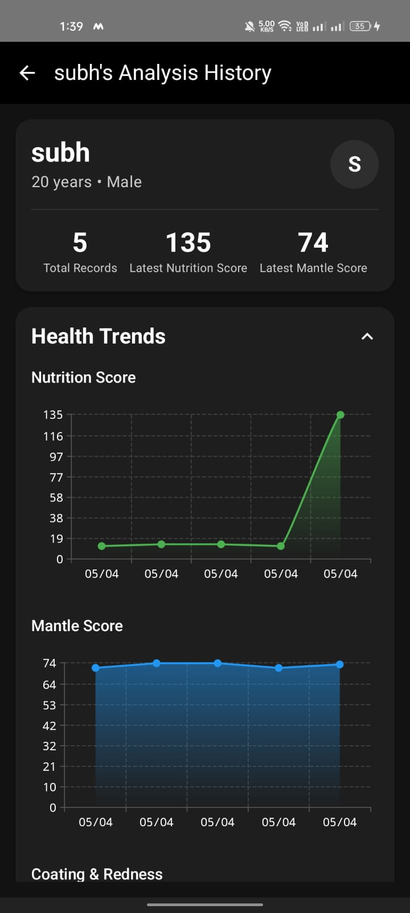
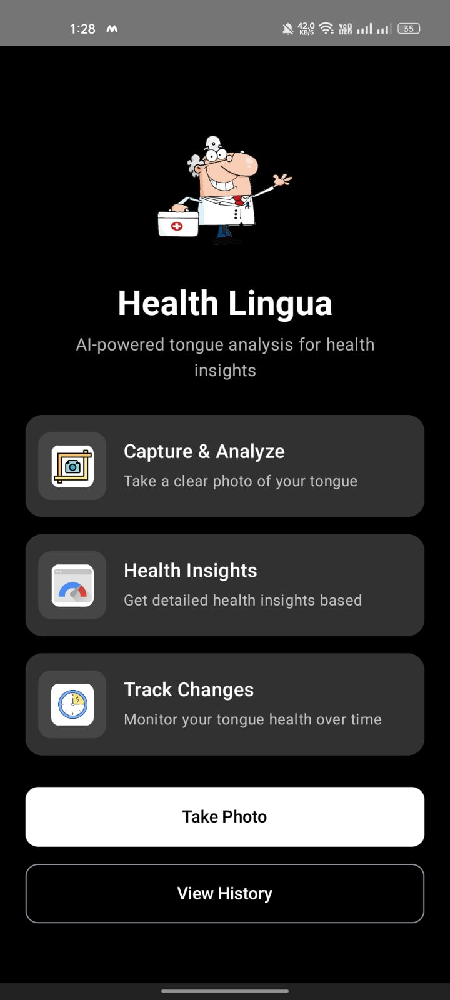
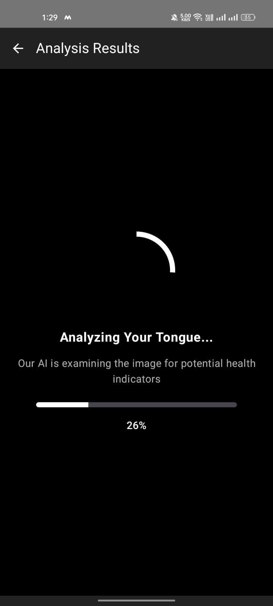

# HealthLingua

## 📱 AI-Powered Tongue Analysis for Holistic Health

HealthLingua is a cutting-edge mobile application that leverages advanced computer vision and machine learning to analyze your tongue and provide insights into your holistic health. Built with Jetpack Compose and Kotlin, this app brings traditional Eastern medical diagnostic methods into the digital age.

## ✨ Features

### Core Functionality
- **Image Capture**: Take a photo of your tongue using your device camera
- **Gallery Import**: Select existing tongue images from your gallery
- **Real-time Analysis**: Get instant AI-powered analysis of your tongue features
- **Health Scoring**: Receive personalized Nutrition and Mantle scores

### Tongue Analysis Parameters
The app extracts five key features from your tongue image, each scored on a scale of 0-10:

1. **Coated Tongue**: Measures the amount of white or yellowish coating
2. **Jagged Tongue Shape**: Evaluates the degree of serrated or uneven edges
3. **Cracks on the Tongue**: Analyzes the number and depth of fissures
4. **Size of Filiform Papillae**: Measures the fine hair-like projections on tongue surface
5. **Redness of Fungiform Papillae**: Evaluates the color intensity of the red, round papillae

### Health Scores
Based on the extracted features, the app calculates:
- **Nutrition Score**: Indicates nutritional balance and potential dietary needs
- **Mantle Score**: Reflects internal energy and overall health state

## 📲 Installation

### Requirements
- Android 8.0 (API level 26) or higher
- Camera permission
- Storage permission for gallery access

### Direct Installation
1. Clone and Build the App

### Server Setup (For Developers)
1. Clone the FastAPI backend repository
2. Install requirements: `pip install -r requirements.txt`
3. Ensure PyTorch and OpenCV are properly configured
4. Start the server: `uvicorn main:app --host 0.0.0.0 --port 8000`
5. Configure the Android app to connect to your server instance

## 🚀 How to Use

1. **Launch the app** from your device's home screen
2. **Grant permissions** for camera and storage when prompted
3. **Choose image source**:
   - Tap "Camera" to take a new photo
   - Tap "Gallery" to select an existing image
4. **Position your tongue** in the center of the frame with good lighting
5. **Capture or select** your tongue image
6. **View the analysis results** showing the five tongue features and health scores
7. **Save or share** your results for future reference or consultation with health practitioners

## 👨‍💻 Technical Details

### Built With
- **Kotlin**: Primary programming language for Android app
- **Jetpack Compose**: Modern UI toolkit for Android
- **CameraX**: API for camera integration
- **FastAPI**: Backend server for image processing and analysis
- **PyTorch**: Deep learning framework for tongue feature extraction
- **OpenCV**: Computer vision library for image preprocessing

### Architecture
- **MVVM Pattern**: Model-View-ViewModel architecture for Android app
- **Clean Architecture**: Separation of concerns for maintainability
- **Repository Pattern**: Abstracts data sources
- **Client-Server Model**: Android client communicates with FastAPI server

### AI Model
- Custom-trained computer vision model using PyTorch
- OpenCV for image preprocessing and feature detection
- Unsupervised feature extraction technique
- Expert-informed heuristics for health scoring
